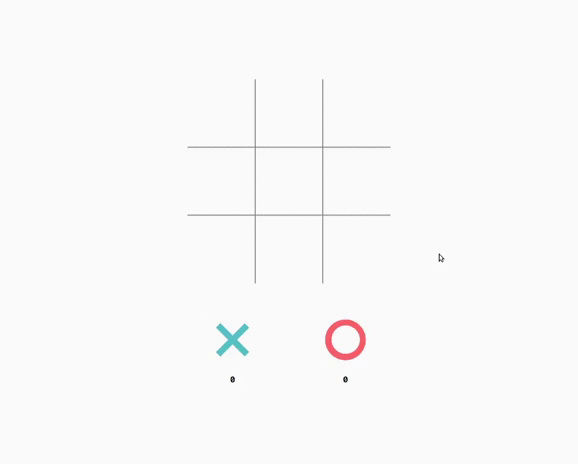

## # Jogo da Velha

<div align="center" >
    
</div>

## 📑 Sobre

Aplicação web do Jogo da Velha com contador de pontos.

## 👨‍💻 Tecnologias 

O projeto foi desenvolvido utilizando

- HTML
- CSS
- JavaScript


## ⬇ Como baixar o projeto

```bash

    #Clonar o Repositório (Via Terminal)
    $ git clone https://github.com/xpedroleonardo/Jogo-da-Velha.git

    #Ou

    #Botão verde acima (Zip)
    Baixar projeto compactado

```


## 🚀 Como executar o projeto

Após baixar o projeto, entre na pasta e abra o arquivo index.html com o navegador e divirta-se.

---

### 💻 Feito por [Pedro Leonardo](https://github.com/xpedroleonardo). 

### Gostou do projeto ? De uma estrela ⭐